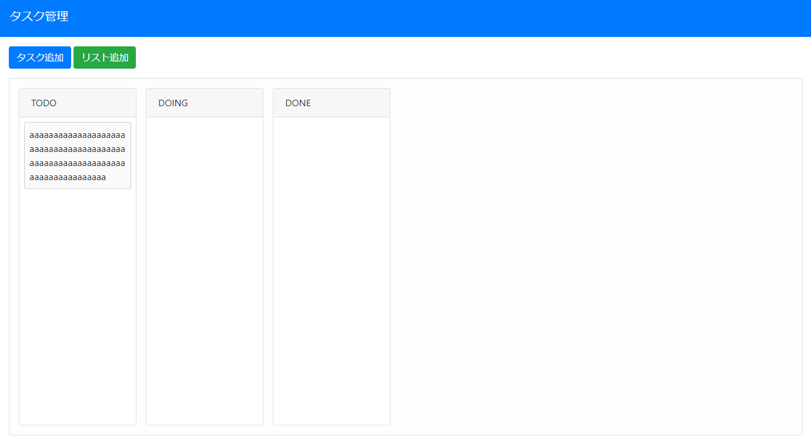
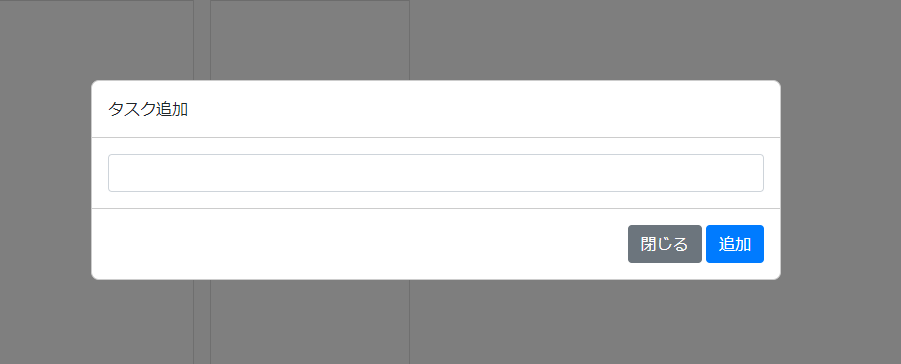

# タスク管理




上記のようなものを作成します。
cssについては簡略化するためにBootstrap4のものを一部使用します。

- [Bootstrap4](https://getbootstrap.jp/docs/4.5/getting-started/introduction/)

## デバッグの方法

デバッガを使用すると`console.log`などを使用しなくてもプログラム実行中の変数の値を確認できます。

- [JavaScript Chromeブラウザでデバッグする方法](https://itsakura.com/js-chrome-debug)

## タスク管理の要件

- タスク追加ボタンがあること
  - タスク追加ボタンを押すとタスク追加用のモーダルが開くこと
    - タスク追加のモーダルには「追加」「閉じる」ボタンがあること
    - 「追加」ボタンを押すと先頭のリストの一番最後にタスクが追加され、モーダルを閉じること
    - 「閉じる」ボタンを押すとモーダルを閉じること
    - タスク追加のモーダルにはタスクを入力するinputがあること
- リスト追加ボタンがあること
  - リスト追加ボタンを押すとタスク追加用のモーダルが開くこと
    - リスト追加のモーダルには「追加」「閉じる」ボタンがあること
    - 「追加」ボタンを押すとボードの最後にタスクが追加され、モーダルを閉じること
    - 「閉じる」ボタンを押すとモーダルを閉じること
    - リスト追加のモーダルにはタスクを入力するinputがあること
- タスクはリスト間をドラッグアンドドロップで移動できること
- タスクは同じリストの中で並べ替えができること
- リストは並べ替えができること

## 作成手順

1. `index.html`、`js/main.js`、`css/style.css`を作成する
2. ヘッダの`html`を作成する(タイトル「タスク管理」)
3. ボタンの`html`を作成する(「タスク追加」「リスト追加」)
4. リストを入れるボードの`html`と`css`を作成する
5. ボードの高さをjavascriptで計算する(windowの高さが変わったときにイベントをセット)
6. リストとタスクのダミーの`html`を作成して`css`で体裁を整える
7. リストとタスクのダミーをテンプレート用の`div`にセットしておく
8. 「TODO」「DOING」「DONE」のリストのみにする
9. リスト、タスク追加用のモーダルの`html`と`css`を作成する
10. ドラッグアンドドロップのjavascriptを実装する
    1. ドラッグアンドドロップのベースを実装
    2. タスクをドラッグしたときのイベントをセット
    3. タスクにドロップされたときのイベントをセット
    4. リストのヘッダをドラッグしたときのイベントをセット
    5. リストにドロップされたときのイベントをセット
    6. 初期表示されているエレメントにイベントをセット
11. 「タスク追加」「リスト追加」のjavascriptを実装する
12. リストの並び替えのjavascriptを実装する

### `index.html`、`js/main.js`、`css/style.css`を作成する

各ファイルを作成してください。

index.html

```html
<!DOCTYPE html>
<html lang="ja">
<head>
  <meta charset="UTF-8">
  <meta name="viewport" content="width=device-width, initial-scale=1.0">
  <title>タスク管理</title>

  <link rel="stylesheet" href="https://stackpath.bootstrapcdn.com/bootstrap/4.5.0/css/bootstrap.min.css" integrity="sha384-9aIt2nRpC12Uk9gS9baDl411NQApFmC26EwAOH8WgZl5MYYxFfc+NcPb1dKGj7Sk" crossorigin="anonymous">
  <link rel="stylesheet" href="css/style.css">
</head>
<body>

  <script src="js/main.js"></script>
</body>
</html>
```

### ヘッダの`html`を作成する(タイトル「タスク管理」)

`h1`を「タスク管理」とします。

```html
  <header class="navbar navbar-dark bg-primary">
    <h1 class="navbar-brand">タスク管理</h1>
  </header>
```

### ボタンの`html`とを作成する(「タスク追加」「リスト追加」)

「タスク追加」と「リスト追加」ボタンを配置します。

各ボタンの処理は共通とするために同じクラス名「js-add」を付け、`data-type`に追加するタイプの値をセットします。

index.html

```html
  <main class="container-fluid my-3">
    <div>
      <button type="button" class="btn btn-primary js-add" data-type="task">タスク追加</button>
      <button type="button" class="btn btn-success js-add" data-type="list">リスト追加</button>
    </div>
  </main>
```

### リストを入れるボードの`html`と`css`を作成する

中のアイテムは横並びで横幅以上のコンテンツになった場合は横スクロールが発生するようにします。

index.html

```html
    <div id="bord">
    </div>
```

style.css

```css
#bord {
  background-color: #fdfdfd;
  border: 1px solid #ddd;
  border-radius: .25rem;

  display: flex;
  overflow-x: auto;

  padding: 1rem;
  margin-top: 1rem;
  width: 100%;
}
```

### ボードの高さをjavascriptで計算する(windowの高さが変わったときにイベントをセット)

main.js

```javascript
// ボードの高さをWindowの高さに合わせる ================================================================================
const changeBoardHeight = function () {
  // ボードのエレメントを取得
  const bord = document.getElementById('bord');
  // 上端の位置を取得
  const bordTop = bord.getBoundingClientRect().top;
  // bodyのフォントサイズを取得
  const defaultFontSize = parseInt(window.getComputedStyle(document.body).fontSize, 10);
  // 高さから上端までの高さと下端に一文字分のスペースを引いたものを高さとする
  bord.style.height = 'calc(100vh - ' + (bordTop + defaultFontSize) + 'px)';
};

// windowのサイズが変わるたびに高さを調整する
window.addEventListener('resize', changeBoardHeight);
// 初期読み込み時に一度実行する
changeBoardHeight();
```

### リストとタスクのダミーの`html`を作成して`css`で体裁を整える

リストの横幅は`200px`でタスクが増えて中に入りきらない場合はスクロールバーを表示する。
リストのヘッダとタスクはドラッグが可能なように`draggable="true"`の属性を付けておく。

index.html

```html
      <div class="card list">
        <div class="card-header" draggable="true">TODO</div>
        <div class="card-body">
          <div class="task" draggable="true">タスク</div>
        </div>
      </div>
```

style.css

```css
[draggable] {
  user-select: none;
}

.list {
  width: 200px;
  position: relative;
}

.list + .list {
  margin-left: 1rem;
}

.list > .card-header {
  cursor: grab;
}

.list > .card-body {
  padding: .5rem;
  overflow-y: auto;
}

.task {
  position: relative;
  padding: .5rem;
  background-color: #fafafa;
  border: 1px solid #ccc;
  border-radius: .25rem;
  cursor: grab;
}

.task + .task {
  margin-top: .5rem;
}
```

### リストとタスクのダミーをテンプレート用の`div`にセットしておく

IEへの対応がいらなければ`template`タグを使用した方が分かりやすい。

index.html

```html
  <div class="d-none js-template">
    <div class="card list">
      <div class="card-header" draggable="true"></div>
      <div class="card-body"></div>
    </div>

    <div class="task" draggable="true"></div>
  </div>
```

### 「TODO」「DOING」「DONE」のリストのみにする

index.html

```html
      <div class="card list">
        <div class="card-header" draggable="true">TODO</div>
        <div class="card-body"></div>
      </div>

      <div class="card list">
        <div class="card-header" draggable="true">DOING</div>
        <div class="card-body"></div>
      </div>

      <div class="card list">
        <div class="card-header" draggable="true">DONE</div>
        <div class="card-body"></div>
      </div>
    </div>
```

### リスト、タスク追加用のモーダルの`html`と`css`を作成する

モーダルはタイトルが違うだけなので同じものを流用する。
Bootstrapのモーダルとかぶらないようにクラス名は`mdl`を使う。
`d-none`はBootstrapのユーティリティクラス。

index.html

```html
  <div id="modal-add" class="mdl d-none">
    <div class="mdl-content">
      <div class="mdl-header"></div>
      <div class="mdl-body">
        <input type="text" class="form-control">
      </div>
      <div class="mdl-footer">
        <button type="button" class="btn btn-secondary js-btn-close">閉じる</button>
        <button type="button" class="btn btn-primary   js-btn-add  ">追加</button>
      </div>
    </div>
    <div class="mdl-backdrop"></div>
  </div>
```

style.css

```css
.mdl {
  position: fixed;
  top: 0;
  right: 0;
  bottom: 0;
  left: 0;
  display: flex;
  flex-direction: column;
  justify-content: center;
  align-items: center;
}

.mdl .mdl-content {
  background-color: #fff;
  border: 1px solid #ccc;
  border-radius: .5rem;
  position: absolute;
  z-index: 1101;
  width: 50%;
  min-width: 400px;
}
.mdl .mdl-header,
.mdl .mdl-body,
.mdl .mdl-footer {
  padding: 1rem;
}

.mdl .mdl-body {
  border-top: 1px solid #ccc;
  border-bottom: 1px solid #ccc;
}

.mdl .mdl-footer {
  text-align: right;
}

.mdl .mdl-backdrop {
  background-color: rgba(0,0,0,.5);
  z-index: 1100;
  position: relative;
  height: 100%;
  width: 100%;
}
```

### ドラッグアンドドロップのjavascriptを実装する

#### ドラッグアンドドロップのベースを実装

`dragover`と`drop`のデフォルトの動作を`document`レベルでキャンセルすることでファイルのドラッグアンドドロップのデフォルト処理をキャンセルする。

style.css

```css
.list.list-drag-over::before {
  content: '';
  position: absolute;
  left: -0.5rem;
  height: 100%;
  width: 1px;
  border-left: 2px solid blue;
}

.list > .card-body.task-drag-over {
  background-color: #ffd;
}

.task.task-drag-over::before {
  content: '';
  position: absolute;
  top: -0.25rem;
  left: 0;
  height: 1px;
  width: 100%;
  border-top: 2px solid blue;
}
```

main.js

```javascript
// ドラッグアンドドロップ ==============================================================================================
// ドラッグ中のタスクを保持しておく変数
let dragTask = null;

// ドラッグ中のリストを保持しておく変数
let dragList = null;

// ドロップされるエレメントの上にドラッグされるアイテムがあるときのクラス
const taskDragOverClass = 'task-drag-over';
const listDragOverClass = 'list-drag-over';

// ファイルなどをドロップされたときの対策としてドキュメント全体のドロップイベントをキャンセルしておく
// ドキュメント全体のドラッグオーバーイベントをキャンセル
document.addEventListener('dragover', function (event) {
  // デフォルトのイベントをキャンセルする
  event.preventDefault();
}, false);

// ドキュメント全体のドロップイベントをキャンセル
document.addEventListener('drop', function (event) {
  // デフォルトのイベントをキャンセルする
  event.preventDefault();
}, false);
```

#### タスクをドラッグしたときのイベントをセット

ドラッグしているタスクの取得、破棄

main.js

```javascript
// ドラッグするタスクのイベントを纏めてセット ======================================================
const addTaskDragEventHandlers = function (task) {
  // ドラッグを開始したとき ====================================================
  task.addEventListener('dragstart', function (event) {
    // ドラッグ中のタスクをセット
    dragTask = event.target;
  }, false);

  // ドラッグを終了したとき ====================================================
  task.addEventListener('dragend', function () {
    // ドラッグ中のタスクを解除
    dragTask = null;
  }, false);
};
```

#### タスクにドロップされたときのイベントをセット

タスクの並べ替えを実装する

main.js

```javascript
// ドロップされるタスクのイベントをセット ==========================================================
const addTaskDropEventHandlers = function (task) {
  // タスクの上にタスクが入ってきたとき ========================================
  task.addEventListener('dragenter', function (event) {
    if (dragTask) {
      // クラス名を付与
      event.target.classList.add(taskDragOverClass);
    }
  }, false);

  // タスクの上からタスクが離れたとき ==========================================
  task.addEventListener('dragleave', function (event) {
    if (dragTask) {
      // クラス名を外す
      event.target.classList.remove(taskDragOverClass);
    }
  }, false);

  // タスクがタスクの上にドロップされたとき ====================================
  task.addEventListener('drop', function (event) {
    // クラス名を外す
    event.target.classList.remove(taskDragOverClass);

    if (dragTask) {
      // エレメントをドロップした位置のエレメントの前に移動
      event.target.insertAdjacentElement('beforebegin', dragTask);
      // ドラッグ中のアイテムを解除
      dragTask = null;
    }
  }, false);
};
```

#### リストのヘッダをドラッグしたときのイベントをセット

ドラッグしているリストの取得、破棄

main.js

```javascript
// ドラッグされるリストのイベントを纏めてセット ====================================================
const addListDragEventHandlers = function (list) {
  const listHeader = list.querySelector('.card-header');

  // ドラッグを開始したとき ====================================================
  listHeader.addEventListener('dragstart', function (event) {
    // ドラッグ中の親要素のカードをセット
    dragList = event.target.parentElement;
  }, false);

  // ドラッグが終了したとき ====================================================
  listHeader.addEventListener('dragend', function () {
    // ドラッグ中のアイテムを解除
    dragList = null;
  }, false);
};
```

#### リストにドロップされたときのイベントをセット

`card-body`にドロップされたときはタスクの移動として処理を行う。
`card(list)`にドロップされたときはリストの移動として処理を行う。

main.js

```javascript
// ドロップされるリストのイベントを纏めてセット ====================================================
const addListDropEventHandlers = function (list) {
  const listBody = list.querySelector('.card-body');

  // ドロップゾーンの上にタスクが入ってきたとき ================================
  listBody.addEventListener('dragenter', function (event) {
    if (dragTask) {
      // クラス名を付与
      event.target.classList.add(taskDragOverClass);
    }
  }, false);

  // ドロップゾーンからタスクが離れたとき ======================================
  listBody.addEventListener('dragleave', function (event) {
    if (dragTask) {
      // クラス名を外す
      event.target.classList.remove(taskDragOverClass);
    }
  }, false);

  // タスクがドロップゾーンにタスクがドロップされたとき ========================
  listBody.addEventListener('drop', function (event) {
    if (dragTask) {
      // クラス名を外す
      event.target.classList.remove(taskDragOverClass);
      // ドロップされたアイテムをリストのボディの最後に移動
      event.target.appendChild(dragTask);
      // ドラッグ中のアイテムを解除
      dragTask = null;
    }
  }, false);

  // リストの上にドラッグ中のリストが入ってきたとき ============================
  list.addEventListener('dragover', function () {
    if (dragList) {
      // クラス名を付与
      list.classList.add(listDragOverClass);
    }
  }, false);

  // ドラッグ中のリストが離れたとき ============================================
  list.addEventListener('dragleave', function () {
    if (dragList) {
      // クラス名を外す
      list.classList.remove(listDragOverClass);
    }
  }, false);

  // ドラッグ中のリストがドロップされたとき ====================================
  list.addEventListener('drop', function () {
    if (dragList) {
      // クラス名を外す
      list.classList.remove(listDragOverClass);
      // エレメントをドロップした位置のエレメントの前に移動
      list.insertAdjacentElement('beforebegin', dragList);
      // ドラッグ中のアイテムを解除
      dragList = null;
    }
  }, false);
};
```

#### 初期表示されているエレメントにイベントをセット

main.js

```javascript
// 初期セット ==========================================================================================================
// 「リスト」にイベントをセット ================================================
document.getElementById('bord').querySelectorAll('.list').forEach(function (list) {
  addListDragEventHandlers(list);
  addListDropEventHandlers(list);
});

// 「タスク」にイベントをセット ================================================
document.getElementById('bord').querySelectorAll('.task').forEach(function (task) {
  addTaskDragEventHandlers(task);
  addTaskDropEventHandlers(task);
});
```

### 「タスク追加」「リスト追加」のjavascriptを実装する

今回のモーダルはスクロールバーが発生することは無いのでがたつきの処理は行わない。

main.js

```javascript
// モーダル用の処理 ====================================================================================================
// 各種変数をセット ================================================================================
// 表示非表示用のクラス名
const dNone = 'd-none';

// 何を追加するのかを判断するための変数
let addType = null;

// モーダルのタイトルやアラート用
const types = {
  task: {
    title: 'タスク追加',
    alert: 'タスクを入力してください',
    add: function (taskName) {
      // 値が入力されているときはタスク追加用のエレメントをクローン
      const task = document.querySelector('.js-template')
                            .querySelector('.task')
                            .cloneNode();
      // 値をセット
      task.textContent = taskName;

      // イベントをセット
      addTaskDragEventHandlers(task);
      addTaskDropEventHandlers(task);

      // 「TODO」に追加
      document.getElementById('bord')
              .querySelector('.list')
              .querySelector('.card-body')
              .appendChild(task);
    }
  },
  list: {
    title: 'リスト追加',
    alert: 'リスト名を入力してください',
    add: function (listName) {
      // 値が入力されているときはタスク追加用のエレメントをクローン
      const list = document.querySelector('.js-template')
                            .querySelector('.list')
                            .cloneNode(true);
      // 値をセット
      list.querySelector('.card-header').textContent = listName;

      // イベントをセット
      addListDragEventHandlers(list);
      addListDropEventHandlers(list);

      // ボードに追加
      document.getElementById('bord')
              .appendChild(list);
    }
  },
};

// モーダル取得
const modalAdd = document.getElementById('modal-add');

// モーダル内のinput
const modalInput = modalAdd.querySelector('input');

// モーダルの表示 ==================================================================================
const showModal = function () {
  modalAdd.classList.remove(dNone);
};

// モーダルの非表示 ================================================================================
const hideModal = function () {
  modalAdd.classList.add(dNone);
};

// 「タスク追加」「リスト追加」ボタンを押したときの処理 ============================================
// 「タスク追加」「リスト追加」ボタンにイベントをセット ========================
document.querySelectorAll('.js-add').forEach(function (btnAdd) {
  btnAdd.addEventListener('click', function (event) {
    // 追加のタイプを取得
    addType = event.target.dataset.type;
    // タイトルの書き換え
    modalAdd.querySelector('.mdl-header').textContent = types[addType].title;
    // inputの内容をクリア
    modalInput.value = '';
    // モーダル表示
    showModal();
  });
});

// モーダルの「閉じる」ボタンにイベントをセット ================================
modalAdd.querySelector('.js-btn-close').addEventListener('click', hideModal);

// モーダルの「追加」ボタンにイベントをセット ==================================
modalAdd.querySelector('.js-btn-add').addEventListener('click', function () {
  // 何も入力されていないとき
  if (modalInput.value === '') {
    alert(types[addType].alert);
    return;
  }

  // 追加処理
  types[addType].add(modalInput.value);

  // モーダルの非表示
  hideModal();
});
```
